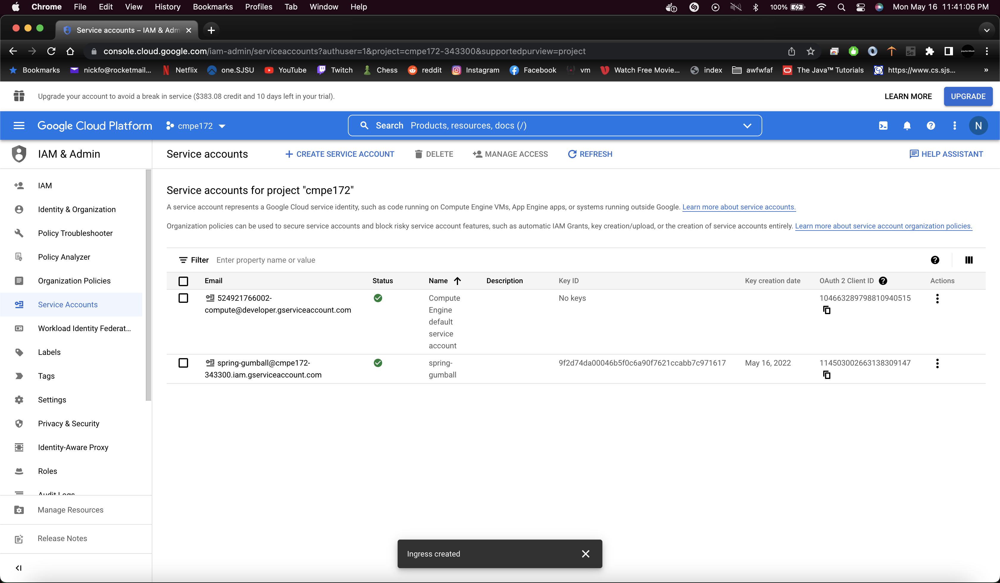
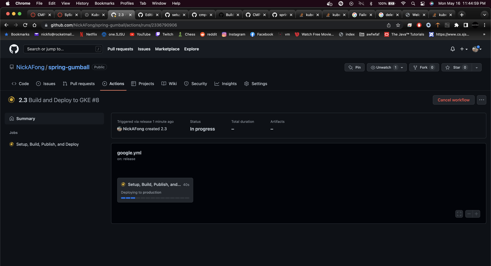

# spring-gumball ci/cd example

### This example demonstrates the following two GitHub Workflows.

* https://help.github.com/actions/language-and-framework-guides/building-and-testing-java-with-gradle

* https://github.com/google-github-actions/setup-gcloud/tree/master/example-workflows/gke

### Build Dependencies

* Gradle 5.6
* JDK 11

This criterion is linked to a Learning OutcomeScreenshots (in Markdown README.md) for CI Workflow (Part 1)

This criterion is linked to a Learning OutcomeScreenshots (in Markdown README.md) for CD Workflow (Part 2)

For this part my ingreess api image was not working so I googled it and used this website for help to edit my ingress https://stackoverflow.com/questions/66080909/logs-complaining-extensions-v1beta1-ingress-is-deprecated

